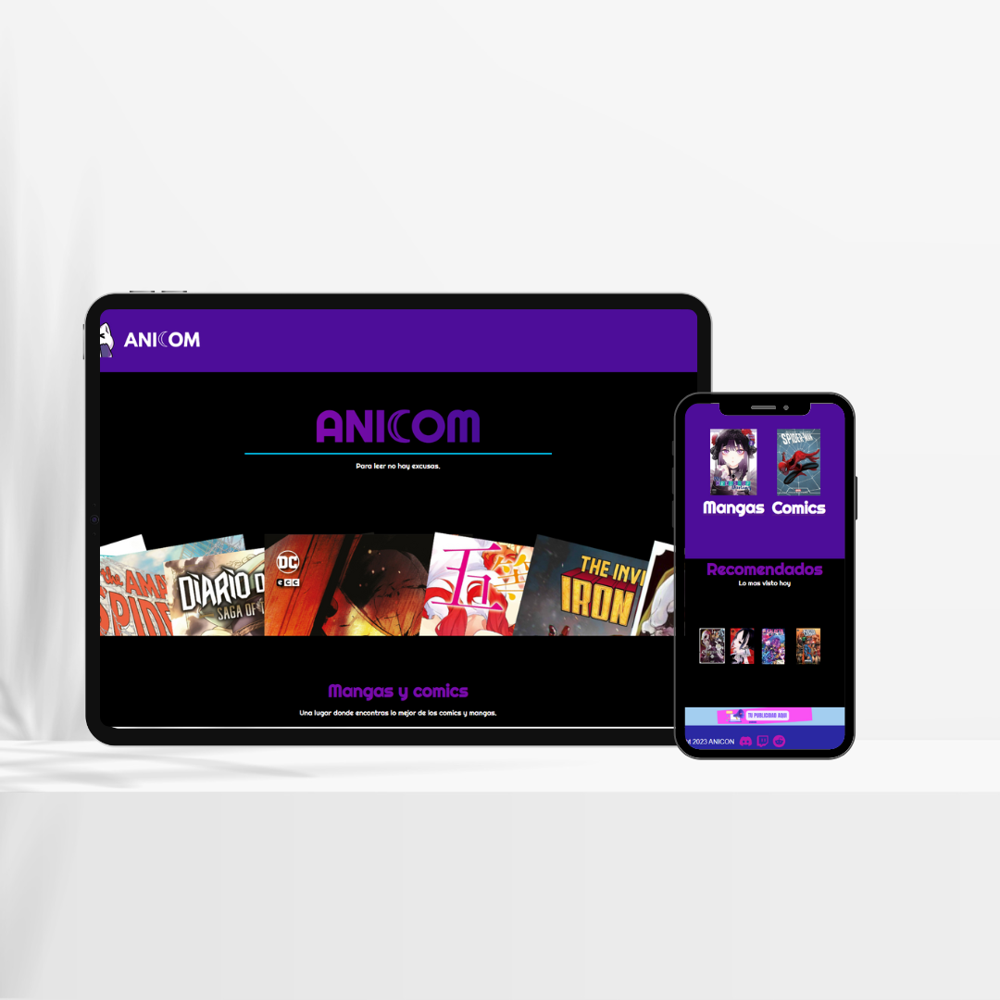

# Proyectos-WEB

Este es un portafolio personal desarrollado para mostrar mis proyectos y habilidades.  

## Tecnologías utilizadas  
- HTML5  
- CSS 
- JavaScript
- Blockchain

## Capturas de pantalla  
### Anicom 
  

### NutriCUT 
  
  
  

### SusEnergy 
  
  
  

## Cómo probarlo  
1. Descargue cualquier proyecto, estan en formato ZIP.  
2. Abre `index.html` en tu navegador.  

